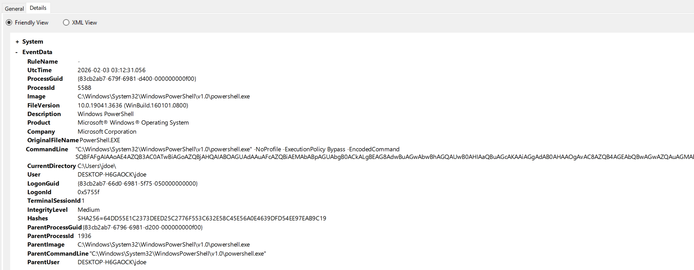

# Suspicious PowerShell Execution (Sysmon) 

## Overview 
This lab simulates suspicious PowerShell execution and documents how to detect it using Sysmon process creation events. 

## Lab Setup 
- Victim: Windows 10 VM
- Monitoring Tool: Sysmon
- Log Source: Sysmon Event ID 1

## Observed Activity 
A PowerShell process was run with ExecutionPolicy Bypass and a Base64-encoded command. 

## Evidence 
- Process: powershell.exe
- Parent Process: explorer.exe
- Sysmon Event ID: 1
- Command-Line Flags:
  - -ExecutionPolicy Bypass
  - -EncodedCommand
- Integrity Level: Medium
- User Context: DESKTOP-H6GAOCK\jdoe

This Sysmon event shows that PowerShell was run with a policy bypass and an encoded payload. This suggests it was likely disguised to avoid command-line inspection.

## Analysis 
Encoded PowerShell execution with policy bypass is a common method that attackers use to avoid detection and run harmful scripts. 

## MITRE ATT&CK Mapping 
- TA0002 – Execution
- T1059.001 – PowerShell

## Conclusion 
This Sysmon event shows that PowerShell was run with a policy bypass and an encoded payload. This suggests it was likely disguised to avoid command-line inspection.
